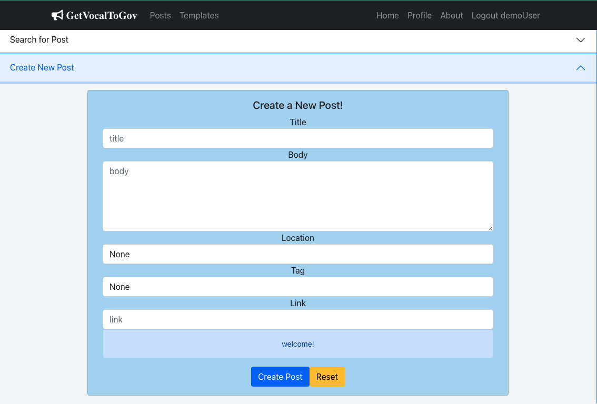

# GetVocalToGov
## Exchange your ideas on current events and let your thoughts be heard!

[](https://getvocaltogov.surge.sh/)


## Description:
This website acts as a vehicle lower barrier for citizens to petition their representatives and exchange ideas on current events. 
- It allows users to make a profile or utilize a demo account to experience core features. 
- Users input their address (or can use the demo account address) to pull the representatives supporting that region, from the President of The United States to local government 
- Users can:
    - create Posts about current events
    - 'bookmark' other User Posts to view later
    - create Templates of a message they would send to their representative
    - 'favorite' other User Templates for quick access
    - 'quick copy' Templates 
    - access their Representatives for the validated address they gave with a Template copied to their clipboard and quickly pass their message using one of the methods of contacting their Representative on the Representative's card
- This was completed in approximately 60 hours as part of Springboard Software Engineering Program.

## Table of Contents
1. [ Tech Stack ](#Tech-Stack)
    - [ Front-end ](#Front-end)
    - [ Back-end ](#Back-end)
    - [ Database ](#Database)
    - [ APIs Integrated ](#APIs)
2. [ Database Schema ](#Schema)
3. [ Deployment ](#Deployment)
4. [ Developer ](#Developer)
5. [ Features ](#Features)
    - [ User Features ](#UserFeatures)
        - [ Registration ](#Registration)
        - [ Login and Demo User ](#LoginAndDemo)
        - [ User Editing ](#EditUser)
        - [ User Deletion ](#DeleteUser)
    - [ Post Features ](#PostFeatures)
        - [ Adding a Post ](#AddPost)
        - [ Updating a Post ](#UpdatePost)
        - [ Deleting Post](#DeletePost)
        - [ Filtering Posts ](#FilterPosts)
        - [ Bookmark Post ](#BookmarkPost)
        - [ Post Details ](#PostDetails)
    - [ Template Features ](#TemplateFeatures)
        - [ Adding a Template ](#AddTemplate)
        - [ Editing a Template ](#EditTemplate)
        - [ Deleting a Template ](#DeleteTemplate)
    - [ Dashboard Features ](#DashboardFeatures)
6. [ Running App Locally ](#RunningLocally)
    - [ Requirements ](#Requirements)
    - [ API Keys ](#APIKeys)
    - [ Import Project to your Local Machine ](#ImportProj)
7. [ Testing ](#Testing) 
8. [ Additional Steps ](#AdditionalSteps)

<a name="Tech-Stack"></a>

## Tech Stack
<a name="Front-end"></a>

### Front-end
React, Axios, React-Bootstrap, React Router, React Hook Form, Yup schema validation

<a name="Back-end"></a>

### Back-end
[ API Repo ](https://github.com/bbeckenb/GetVocalToGov) - 
Node.js, Express, Node-postgres, jsonwebtoken, jsonschema, bcrypt, winston, Axios, dotenv, colors, cors

<a name="Database"></a>

### Database
Postgres

<a name="APIs"></a>

### APIs integrated
- [ Google Civic Information API ](https://developers.google.com/civic-information/docs/v2)
- [ EasyPost ](https://www.easypost.com/docs/api)

<a name="Schema"></a>

## Schema


<a name="Deployment"></a>

## Deployment
The Front-End React App is deployed on surge at [https://getvocaltogov.surge.sh/](https://getvocaltogov.surge.sh/)

<a name="Developer"></a>

## Developer
### Bryce Beckenbach


Please feel free to reach out!
- Email: [brycebeckenbach@gmail.com](mailto:brycebeckenbach@gmail.com)
- [ Linkedin ](https://www.linkedin.com/in/bryce-beckenbach-52a5276a/)

<a name="Features"></a>

## Features:

<a name="UserFeatures"></a>

### User Features

<a name="Registration"></a>

#### Registration
User Registration uses a form to gather the information and pass it through the [ API ](https://github.com/bbeckenb/GetVocalToGov), to create the User or report back what is wrong with the inputted data. User enters desired username, password, first name, last name, street, city, state, zip, and email. All information is required, username (as the primary key for the users table) must be unique for the model to generate a User instance. Password is run through Bcrypt hashing function where the output is stored in the database. The address information (street, city, state, and zip) are verified through the EasyPost API. If the address passes verification, the User instance is stored in the database and a JSON Web Token is sent back to the front-end to be stored in a piece of state (token using setToken) and on the GetVocalToGovApi class for further calls that require User authorization. A second call is then made to the [ GetVocalToGov API ](https://github.com/bbeckenb/GetVocalToGov) to get the User details which are stored in a piece of state (currUser using setCurrUser). 


Yup is used on the React Hook Form for schema validation to ensure the API is receiving the best data it can enforce. If the data falls out of specified parameters, the form halts submission and a specific message populates for the field in question.  


To give the User messages from the API in response to their inputs, each form has a built in alert box that displays text and color indicitive of the situation. It starts as a blue 'welcome' message, but will display red if there is an error from the [ GetVocalToGov API ](https://github.com/bbeckenb/GetVocalToGov). Then will display a green 'success' message or re-route to the appropriate place depending on the form and situation. For registration, it re-routes home.

'welcome'


'duplicate username'


'bad address'


'success' (from Template Creation)


<a name="LoginAndDemo"></a>

#### Login and Demo User
User Login operates very similarly to Registration. It uses a form to gather the username and password credentials to pass to the [ API ](https://github.com/bbeckenb/GetVocalToGov). The API runs the inputted password through a bcrypt compare function with the hash output stored in the database. If the compare returns bool True, the API returns a signed JSON Web Token (JWT). The JWT is stored in a piece of state (token using setToken) and on the GetVocalToGovApi class for further calls that require User authorization. A second call is then made to the [ GetVocalToGov API ](https://github.com/bbeckenb/GetVocalToGov) to get the User details which are stored in a piece of state (currUser using setCurrUser). 

To reduce barrier of entry of someone trying to experience the App, I integrated a 'Demo' button on the Login form. This automatically passes Demo User credentials to the API behind the scenes:
- Username: demoUser
- Password: passGood

**NOTE:** There is backend logic to protect demoUser from modification or deletion


<a name="EditUser"></a>

#### User Editing
Once a user is logged in, they can navigate to 'Profile' either through the navbar or from the homepage when they click on the 'Options' button.

**Home Options**


Once on their Profile page, they will see drop-down options to 'Edit Profile' as 'User Options' is default on the 'Profile' page. When they expand it, they will see an 'Edit Profile' form auto-populated with their current User information. To edit their information, they simply need to change the information stored in the current fields, enter the correct password to confirm their changes, and click 'Edit User' at the bottom of the form. The form validation will operate the same as [ Registration ](#Registration). If the data is accepted, the [ API ](https://github.com/bbeckenb/GetVocalToGov) will authenticate the password provided with the original username, the address will be verified, and if all that passes, the database will be updated and an updated JWT will be provided. The JWT is stored in a piece of state (token using setToken) and on the GetVocalToGovApi class for further calls that require User authorization. A second call is then made to the [ GetVocalToGov API ](https://github.com/bbeckenb/GetVocalToGov) to get the User details which are stored in a piece of state (currUser using setCurrUser). 


<a name="DeleteUser"></a>

#### User Deletion
Once a User is logged in, they can navigate to 'Profile' either through the navbar or from the homepage when they click on the 'Options' button, same as navigating to [ User Editing ](#EditUser) above. They will see an option to 'Delete Profile' under 'User Options'. When they expand this drop-down, they will see the Delete User Portal.

Delete User Portal


When they click 'Delete' once, they will see the warning text asking them to confirm they want to delete their profile:


If they click 'Cancel', the prompt will revert back to the original intro message. If they click 'Delete' again, the front-end will send a command to the [ GetVocalToGov API ](https://github.com/bbeckenb/GetVocalToGov) to delete that User instance. If it is the demoUser, the API will send a message to the front-end that the demoUser profile 'cannot be deleted or modified'. If it is not the demoUser, that User instance will be removed from the database and the front-end will clear the token and currUser pieces of state, then redirect to the no-user version of the home page.

<a name="PostFeatures"></a>

### Post Features
A Post, in this context, is a User generated record containing information and commentary about a current event. Users can create then edit and/or delete Posts they own. Any User can read or bookmark/unbookmark a Post from the main Post feed. Posts are meant to create awareness of current events and to inspire Users to generate Templates to petition their Representatives. They consist of a title, body (to assert whatever the Post is about), link to article/reference (nullable), tag (to mark category), created_at (timestamp), and location (what state the post is referencing or if it is a federal issue, use District of Columbia). 

**Post Example**


<a name="AddPost"></a>

#### Adding a Post
There are two locations that allow a User to create a new Post. The first is by navigating to the Posts feed by clicking 'Posts' on the navbar or under the 'Options' drop-down on the home page. The second is by navigating to the 'Profile' page and selecting the 'Posts Created' tab on the secondary navbar.

**Navigating to Posts Feed**


**Posts Feed**
Posts Feed displays all Posts from all Users and can be filtered (more on that later)


**Posts Created**


The behavior is the same in both locations, but to explain the process we will go through the 'Posts Feed'. Once on the Posts Feed (accessible to Users and non-Users, however the capability to create a post is only available to logged in Users), the User will see the drop-down option to 'Create New Post'.

**Create New Post**


The User fills in the fields ('Location' and 'Tag' are drop-down select fields, Link is nullable), then clicks 'Create Post' at the bottom of the field. Form validation of the front-end will ensure all fields are within tolerance. The form data will then be sent to the [ GetVocalToGov API ](https://github.com/bbeckenb/GetVocalToGov) which will perform its own schema validation, then if all data is within tolerance, store the record in the database and pass back additional information (created_at). This instance will immediately be able for viewing on the 'Posts Feed' or 'Posts Created' list. 

#### Updating Post
To update a Post, the User has to have ownership (they must have created the Post to have ownership) of the Post in question. If they do, they will see an option to 'Edit' at the bottom of the Post:

**Owned Post Example**


If they do not, they will only see an option to view 'Details'.

**unOwned Post Example**


If they click on 'Edit' on a Post they own, the User will be redirected to an Edit Post Portal for that particular Post. The form will be auto-populated with the current data of the Post in question. The User simply changes whichever fields they want to alter and clicks 'Edit Post' at the bottom of the form. Form validation of the front-end will ensure all fields are within tolerance. The form data will then be sent to the [ GetVocalToGov API ](https://github.com/bbeckenb/GetVocalToGov) which will perform its own schema validation, then if all data is within tolerance, store the record updates in the database. The updated instance will immediately be able for viewing on the 'Posts Feed' or 'Posts Created' list. 

**Edit Post Portal**


<a name="DeletePost"></a>

#### Deleting Post
To delete a Post, the User has to have ownership (they must have created the Post to have ownership) of the Post in question. If they do, they will see an option to 'Delete' at the bottom of the Post:

**Owned Post Example**


If they click this 'Delete' button, the Post id along with the user token (to check for ownership) will be sent to [ GetVocalToGov API ](https://github.com/bbeckenb/GetVocalToGov). If they have ownership and the record exists, it will be deleted from the database, the front-end will be informed and updated by removing the Post in question.

<a name="FilterPosts"></a>

#### Filtering Posts
There are three Post Lists on the app that allow a User to filter the Posts. The first is by navigating to the Posts feed by clicking 'Posts' on the navbar or under the 'Options' drop-down on the home page. The second is by navigating to the 'Profile' page and selecting the 'Posts Created' tab on the secondary navbar. The third is by navigating to the 'Profile' page and selecting the 'Posts Bookmarked' tab on the secondary navbar. For the second two, you need to be logged in.

**Navigating to Posts Feed**


**Posts Feed**: Posts Feed displays all Posts from all Users


**Posts Created**: Posts Created shows a logged in User all of the Posts they have personally created


**Posts Bookmarked**: Posts Bookmarked shows a logged in User all of the Posts they have bookmarked (more on that later)


The behavior is the same in all locations, but to explain the process we will go through the 'Posts Feed'. Once on the Posts Feed (accessible to Users and non-Users, as is the 'Search for Post' functionality), the User will see the drop-down option to 'Search for Post'. Once clicked, this will present a 'Search Posts' form where the User can select any and all of search criteria 'title' (matching phrase), 'body' (matching phrase), 'location' (select field), and 'tag' (select field).

**Search Posts**


Once the User enters their search criteria and selects 'Search Posts' at the bottom of the form, the request will be sent to the [ GetVocalToGov API ](https://github.com/bbeckenb/GetVocalToGov). The database will be queried for records that match all filters. The resulting list will be sent and displayed on the front-end along with the search criteria in the form's alert message box.

**Search Posts Success**


<a name="BookmarkPost"></a>

#### Bookmarking a Posts
Bookmarking, in this context, is a feature meant to allow a User to tag a Post of interest to be more easily accessed when they want to find it again at a later time. This is a feature only accessible to a logged-in User. When logged-in viewing Posts, the User will see a yellow bookmark icon on all Posts. If it is outlined, the Post has not been tagged, if it is filled in, the Post has been tagged. The user can toggle bookmarked status by clicking on the icon button.

**Post unbookmarked**


**Post bookmarked**


For ease of finding a User's bookmarked Posts, the User simply has to navigate to their 'Profile' page and select 'Posts Bookmarked' on the secondary navbar. This will show the User a list of their Bookmarked posts from most recently created to least recently created.

**Posts Bookmarked List**


<a name="PostDetails"></a>

#### Post Details
Post Details are available to logged-in Users and non logged-in visitors. When viewing a Post, there will always be a 'Details' button available at the bottom. Clicking upon this will bring the User to a Post Details page for that particular Post. This will show the Post in question, a Template Creation Portal for that particular Post, and a list of all Templates (more on these shortly) currently associated with that Post. 

**Post Details**


You can create a new Template you want associated to the Post you are viewing the details of by expanding the 'Create New Template For This Post' drop-down, filling out and submitting the form! Probably a helpful time to explain what a Template is, Template Features section is right below this.

**Post Details Create Related Template**


<a name="TemplateFeatures"></a>

### Template Features
A Template, in this context, is a User generated title and body of an email one would send to their Representative. Here is a sample [reference](https://www.nlacrc.org/home/showdocument?id=272) of how one could structure Template content. Users can create Templates on a [Post's details page](#PostDetails) in relation to that Post or independently unattached to a Post. They can then update and/or delete Templates they own. All Users can read and favorite/unfavorite Templates from the Template feed. They consist of a title, body (to assert whatever the Post is about), and created_at (timestamp). 

**Template Example**


<a name="AddTemplate"></a>

#### Adding a Template
There are three locations that allow a User to create a new Template. The first is by navigating to the Templates feed by clicking 'Templates' on the navbar or under the 'Options' drop-down on the home page. The second is by navigating to the 'Profile' page and selecting the 'Templates Created' tab on the secondary navbar. The third is on a [Post's details page](#PostDetails).

**Navigating to Templates Feed**


**Templates Feed**: Templates Feed displays all Templates from all Users and can be filtered (more on that later)


**Templates Created**


**Post Details Create Related Template**


The behavior is the same in all three locations, but to explain the process we will go through the 'Templates Feed'. Once on the Templates Feed (accessible to Users and non-Users, however the capability to create a Template is only available to logged in Users), the User will see the drop-down option to 'Create New Template'.

**Create New Template**


The User fills in the fields, then clicks 'Create Template' at the bottom of the field. Form validation of the front-end will ensure all fields are within tolerance. The form data will then be sent to the [ GetVocalToGov API ](https://github.com/bbeckenb/GetVocalToGov) which will perform its own schema validation, then if all data is within tolerance, store the record in the database and pass back additional information (created_at). This instance will immediately be able for viewing on the 'Templates Feed', 'Templates Created', or The Post's Details page. 

<a name="EditTemplate"></a>

#### Editing a Template
To update a Post, the User has to have ownership (they must have created the Post to have ownership) of the Post in question. If they do, they will see an option to 'Edit' at the bottom of the Post:

**Owned Post Example**


If they do not, they will only see an option to view 'Details'.

**unOwned Post Example**


If they click on 'Edit' on a Post they own, the User will be redirected to an Edit Post Portal for that particular Post. The form will be auto-populated with the current data of the Post in question. The User simply changes whichever fields they want to alter and clicks 'Edit Post' at the bottom of the form. Form validation of the front-end will ensure all fields are within tolerance. The form data will then be sent to the [ GetVocalToGov API ](https://github.com/bbeckenb/GetVocalToGov) which will perform its own schema validation, then if all data is within tolerance, store the record updates in the database. The updated instance will immediately be able for viewing on the 'Posts Feed' or 'Posts Created' list. 

**Edit Post Portal**


<a name="DeleteBT"></a>

#### Deleting a BudgetTracker
To delete a BudgetTracker, navigate to the associated Account on the Dashboard where it lives. At the bottom of the BudgetTracker Card, click on the 'delete' icon. The BudgetTracker will be removed from the database and the HTML will return the 'Create BudgetTracker' button under the Account.

*(BudgetTracker Delete: Bottom of BudgetTracker red 'delete' icon)*


*(BudgetTracker Create Button returned)*


<a name="DashboardFeatures"></a>

### Dashboard Features
The dashboard is designed to be a quick view of the aggregate of all of a User's Financial Institutions. The total holdings, both with and without loans are displayed in the top left of the dashboard. The User Model has a method that runs through all of the User instance's Financial Institutions, summing their dollar totals, with a boolean input to signify whether or not to return the sum with loans included (loans are subtracted from the total as they are a dollar amount owed). Financial Institutions have a similar method that allows them to run through all of their Accounts and provide a dollar sum with or without loans. Both of these values are displayed and color coded (green signifies a positive balance, grey means a $0 balance, red is a negative balance).


To the right of the dollar view in the dashboard is a pie chart that shows a percentage breakdown of how Financial Institution sums (without loans) represent a User's total wealth. This utilizes Google Charts.


As a User deletes Financial Institutions and/or Accounts to track, the Dashboard will update on the static page to reflect the changes.

<a name="RunningLocally"></a>

### Running App Locally

<a name="Requirements"></a>

#### Requirements
- Python
- PostgresSQL
- pip 

<a name="APIKeys"></a>

#### API Keys
Retrieve free API keys from:
- [ Plaid ](https://plaid.com/docs/api)
- [ Twilio ](https://www.twilio.com/docs)

<a name="ImportProj"></a>

#### Import Project to your Local Machine
1. Clone the repository:
    - `git clone https://github.com/bbeckenb/Wealth_and_Budget_App.git`

2. Change Directory to the project:
    - `cd Wealth_and_Budget_App`

3. Create and Activate Python Virtual Environment:
    - `python3 -m venv venv`
    - `source venv/bin/activate`

4. Install requirements:
    - `pip install -r requirements.txt`

5. Set up local database:
    - `createdb wealth_and_budget_db`

6. Set up .env file:
    - `touch .env`

7. Add the following fields and enter your information (Requires API key retrieval step) where it says **YOUR_INFO** 
    ```
    PLAID_CLIENT_ID=YOUR_INFO
    PLAID_SECRET=YOUR_INFO
    PLAID_PRODUCTS=auth,transactions
    PLAID_COUNTRY_CODES=US,CA
    TWILIO_Account_SID=YOUR_INFO
    TWILIO_AUTH_TOKEN=YOUR_INFO
    TWILIO_NUM=YOUR_INFO
    SECRET_KEY=YOUR_INFO
    ```
    **NOTE:** `SECRET_KEY` can be whatever you want it to be, you can generate 16 random bytes of hex digits using `hexdump -n 16 -e '4/4 "%08X" 1 "\n"' /dev/urandom` in the command line.

8. Job Scheduling:
    - Script `scheduled_jobs.py` is scheduled to run on Heroku
    - If you choose to run this locally, include following code in main `app.py` and follow directions below:
        - **Dependencies to import:**
            ```
            from flask_crontab import Crontab
            from CronJobs.UFI_jobs import scheduled_daily_refresh_all_Accounts
            from CronJobs.BudgetTracker_jobs import scheduled_budget_tracker_jobs
            ```
        - **Initializations:**
            `crontab = Crontab(app)`
        - **CRON schedule function definition:**
            ```
            @crontab.job(minute=0, hour=12)
                def scheduled_jobs():
                    scheduled_daily_refresh_all_Accounts(plaid_inst)
                    scheduled_budget_tracker_jobs(plaid_inst, twilio_inst)
            ```
        - **Command Line directions:**
            - CRON Scheduled Jobs For local server
            - **This will run a job everyday at 12pm UTC:** run `flask crontab add` in command line to initialize 
            - **This will delete the CRON job:** run `flask crontab remove` in command line to remove
            - **These are additional command line commands to navigate jobs**
                - `crontab -l` to see list of jobs
                - `crontab -e` to manually edit list of jobs, 'esc' :wq 'enter' to leave list

9. Run Flask Application
- `export FLASK_ENV=production`
- `export FLASK_RUN_PORT=5000`
- `flask run`

<a name="Testing"></a>

### Testing
Testing for Models and Views was written using Python's [ Unittest Framework ](https://docs.python.org/3/library/unittest.html). Tests can be seen in test folder.    

<a name="AdditionalSteps"></a>

### Additional Steps
I built this application as part of SpringBoard's Software Engineering curriculum and put in ~60 hours. If I were to continue developing it, there would be several steps I would take.

#### Pull in Additional Data
I originally planned on having this app be a one-stop-shop to see all of your bank data, house, 401k, Roth IRA, etc., I think this would lead to a more useful application. I would likely go back to Plaid to pull in investment account data (can't without the paid service), and to Zillow for house value, putting bank, house, and investment portfolio on different tabs on the Dashboard. I will come back to this in the future.

#### Error handling and Logging
I would build out logging functionality to store request/response and errors (separately) that occur in a central location. That way I could see if there are issues that I need to adjust for. I would build out my error handling according to this. I would also Account for when the APIs integrated go down.

#### Administrative User functionality
I would add an is_admin boolean to the User model and add an Admin portal on the web app itself. It would be much easier to manage data on the app, both test and real. 